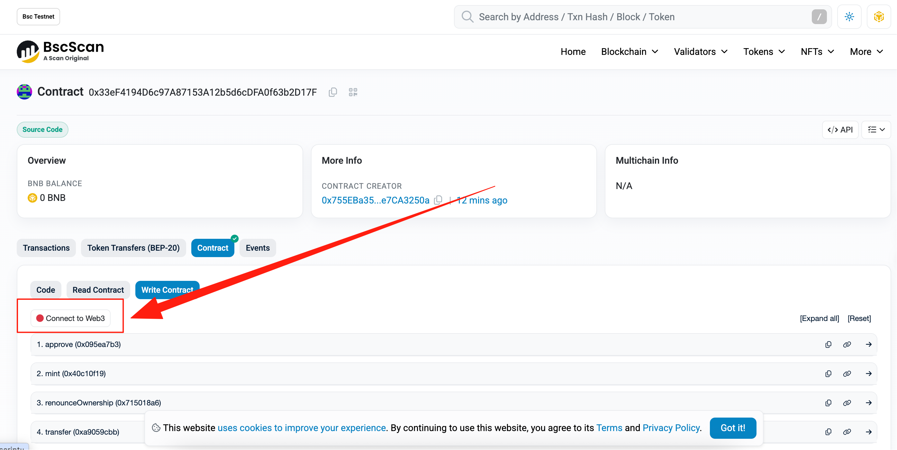
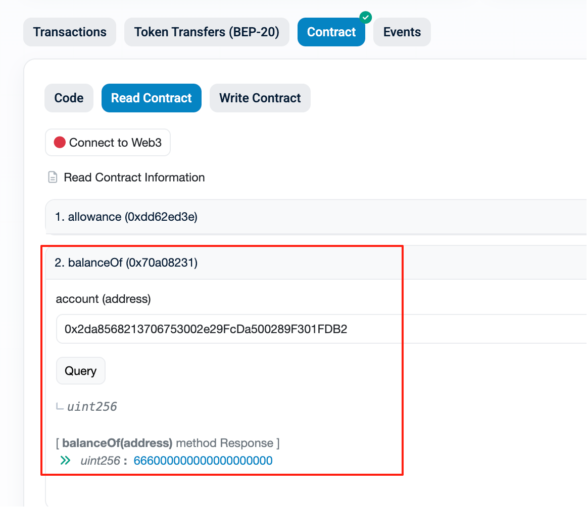
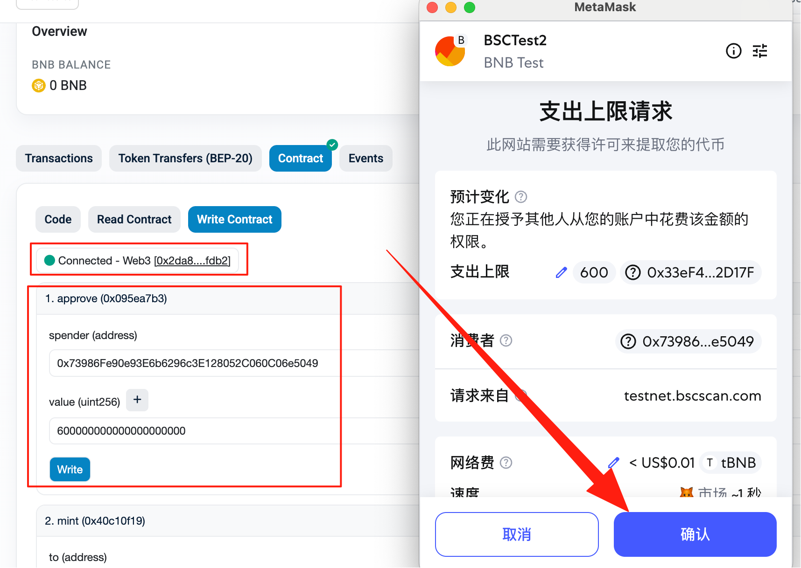
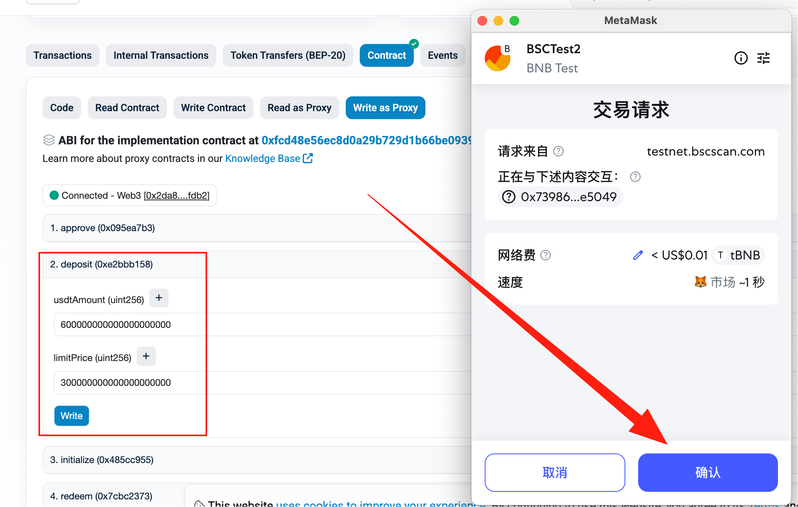
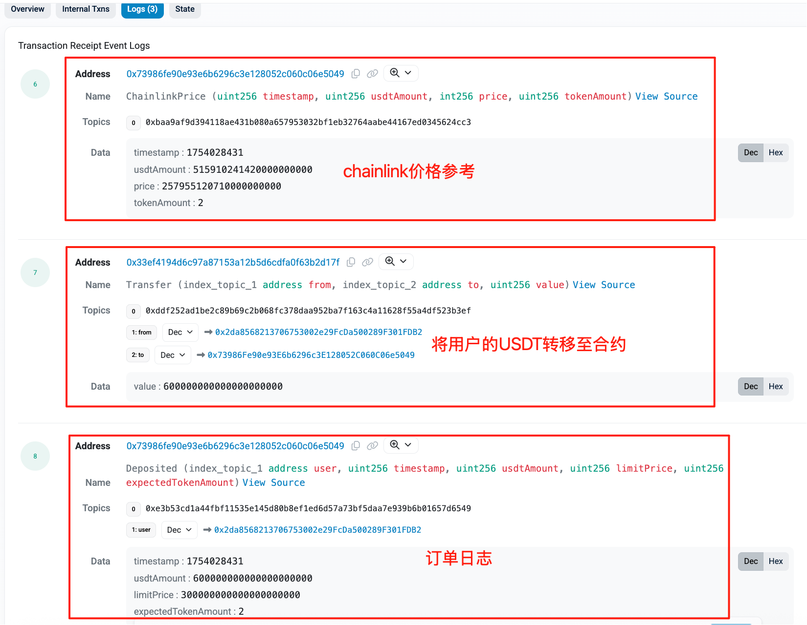
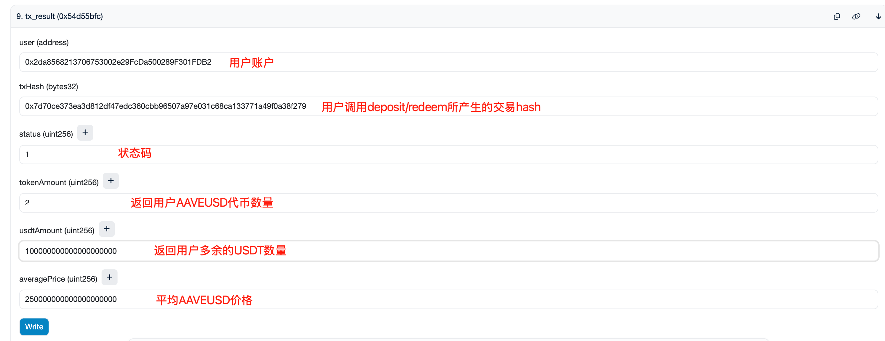

- 📋 合约信息:
   - TestUSDT: 0x33eF4194D6c97A87153A12b5d6cDFA0f63b2D17F 小数点：18
   - AAVEUSD代理: 0x73986Fe90e93E6b6296c3E128052C060C06e5049 小数点：0
   - AAVEUSD实现: 0xFCD48E56eC8d0A29b729d1B66BE0939d88488Df8
   - Chainlink预言机: AAVE/USD（简化版）小数点：8

- 🔗 区块链浏览器链接:
   - TestUSDT: https://testnet.bscscan.com/address/0x33eF4194D6c97A87153A12b5d6cDFA0f63b2D17F
   - AAVEUSD代理: https://testnet.bscscan.com/address/0x73986Fe90e93E6b6296c3E128052C060C06e5049
   - AAVEUSD实现: https://testnet.bscscan.com/address/0xFCD48E56eC8d0A29b729d1B66BE0939d88488Df8

# 用户购买/赎回流程
# 购买流程

## 首先需要用户账户有USDT代币

### 铸造代币(如果不够需要铸造),并授权给AAVEUSD合约
1. 进入TestUSDT浏览器网页
2. 连接钱包：点击Contract=>Write Contract=>点击Connect to web3=>点击确定=>点击MetaMask=>选择自己地址=>连接
3. 调用mint函数给自己mint USDT to输入自己地址，amount输入数量(注意小数点有18位)，比如mint 666枚USDT，amount输入： 666000000000000000000
4. 点击weirt=>弹出钱包=>点击确认
5. 查看USDT余额：调用USDT的balanceOf函数，查看自己地址的USDT余额
6. 给AAVEUSD地址授权USDT：点击Write Contract=>点击approve=>输入参数=>点击Write

### 购买
1. 进入AAVEUSD代理浏览器页面
2. 连接钱包：点击Contract=>Write Contract=>点击Connect to web3=>点击确定=>点击MetaMask=>选择自己地址=>连接
3. 点击deposit函数=>输入usdtAmount(eg:600000000000000000000)和limitPrice(限价 eg:300000000000000000000)=>点击Write=>弹出钱包=>点击确认=>点击View your transaction查看交易详情
4. 可以点击View your transaction查看交易详情
5. 后端将获取订单日志信息，然后进行美股账户交易，然后使用AAVEUSD的owner地址调用tx_result函数，返回订单结果
    - 5.1. 切换metaMask钱包至owner账户，先断开钱包和网站连接，刷新网页，再次连续，切换连接地址
    - 5.2. 调用tx_result函数
